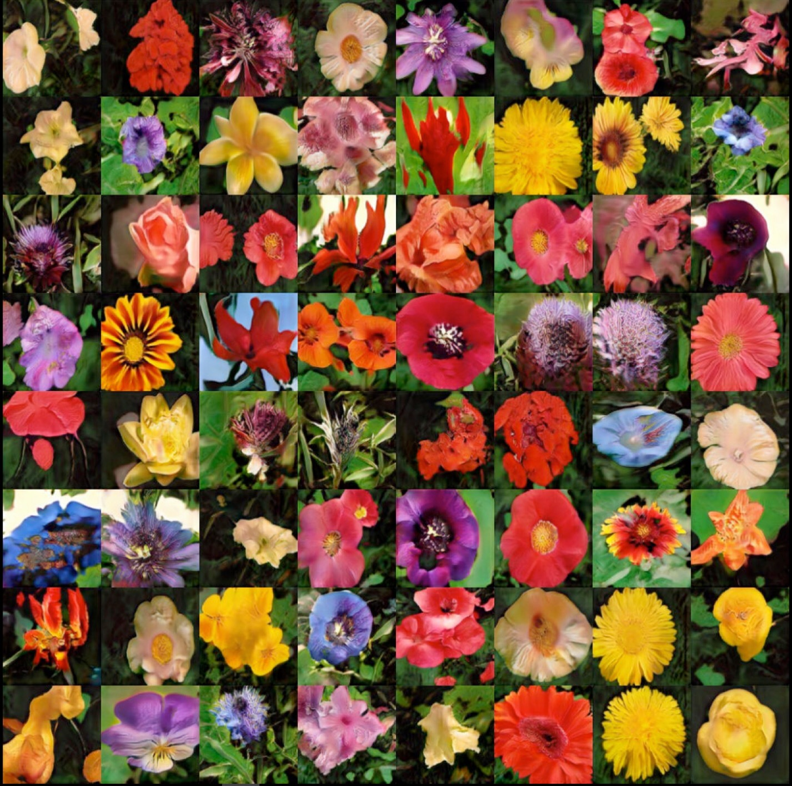
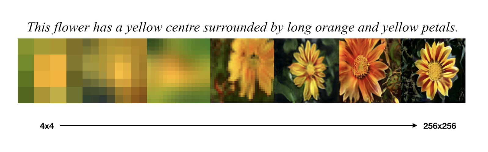
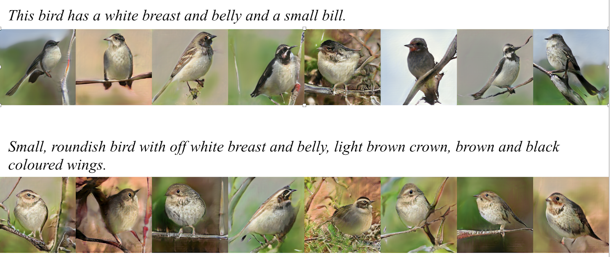

# Text to Image Synthesis using Generative Adversarial Networks

This is the Tensorflow implementation for Text to Image Synthesis using Generative Adversarial Networks.

This implementation is heavily based on https://github.com/crisbodnar/text-to-image

## Images generated by the Conditional GAN

As it can be seen, the generated images do not suffer from mode collapse.

Illustration of Conditional Wasserstein Progressive Growing GAN on the flowers dataset:

Samples from the birds dataset

## How to download the dataset

1. Setup your `PYTHONPATH` to point to the root directory of the project.
2. Download the preprocessed [flowers text descriptions](https://drive.google.com/file/d/0B3y_msrWZaXLaUc0UXpmcnhaVmM/view) 
and extract them in the `/data` directory.
3. Download the [images from Oxford102](http://www.robots.ox.ac.uk/~vgg/data/flowers/102/102flowers.tgz) 
and extract the images in `/data/flowers/jpg`. You can alternatively run `python preprocess/download_flowers_dataset.py` from the 
root directory of the project.
4. Run the `python preprocess/preprocess_flowers.py` script from the root directory of the project.

## Instruction to Run

To run the program run the following instruction from the root directory of the project: `python --cfg [path_to_config]`. If the `--cfg` flag is not specified, then the default config 
from `./models/gancls/cfg/flowers.yml` will be used. You can switch between training and testing 
by setting TRAIN.FLAG to either true or false in the config.

Video tutorial to test the model and its corresponding output results: https://drive.google.com/file/d/1apBTC6oDAQwKe7bnNE_xDmswJfU7irbb/view?usp=sharing

### Requirements

- python==3.7.3
- tensorflow==1.14
- scipy==1.2.0
- numpy==1.16.4
- pillow==6.1.0
- easydict==1.9
- imageio==2.4.1
- imageio-ffmpeg==0.3.0
- pyyaml==5.1.2